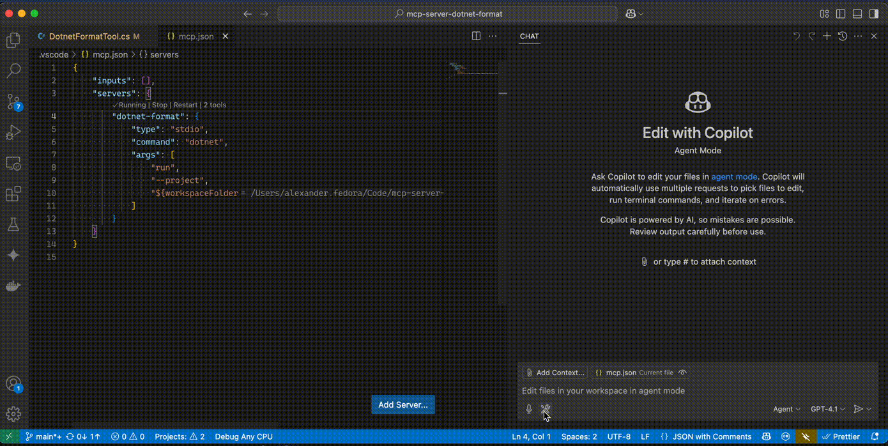

# McpServerDotnetFormat

A Model Context Protocol (MCP) stdio server for formatting .NET projects and files using the `dotnet format` CLI. This project enables agent-based tools (such as GitHub Copilot) to invoke formatting commands programmatically, supporting both local and containerized workflows.



## Features

- Exposes formatting commands for .NET projects and files via MCP stdio server.
- Supports formatting entire projects, individual files, or directories.
- Enforces `.editorconfig`, StyleCop, and analyzer rules.
- Can be run locally or as a Docker container.

### Limitations

- JetBrains Rider is not getting shell commends from output, it expects tool to format it

### TODO

- We can change from returning the tool to actually running the tool. In order to do that we need:
  - Run tool instead of returning command to the agent.
  - For docker scenario, provide way to mount repository root to the docker
  - Also install dotnet-format into the docker file, so it will work out of the box

## Getting Started

### Prerequisites

- .NET 9.0 SDK (see `global.json` for the pinned version)
- Docker (for containerized usage)

### Building the Project

```sh
dotnet build
```

### Running the MCP Server (Stdio)

You can run the server directly using the following configuration in your `mcp.json`:

```jsonc
"dotnet-format": {
    "type": "stdio",
    "command": "dotnet",
    "args": [
        "run",
        "--project",
        "/PATH/mcp-server-dotnet-format/src/McpServerDotnetFormat/McpServerDotnetFormat.csproj"
    ]
}
```

This will start the MCP stdio server, ready to accept formatting requests.

### Publishing a Docker Image

To build and publish the Docker image for multiple platforms:

```sh
dotnet publish /t:PublishContainer src/McpServerDotnetFormat/McpServerDotnetFormat.csproj
```

Example output:

```
Restore complete (0.2s)
  McpServerDotnetFormat succeeded (6.6s) → src/McpServerDotnetFormat/bin/Release/net9.0/linux-arm64/publish/
  McpServerDotnetFormat succeeded (7.2s) → src/McpServerDotnetFormat/bin/Release/net9.0/linux-x64/publish/
  McpServerDotnetFormat succeeded (0.3s) → src/McpServerDotnetFormat/bin/Release/net9.0/publish/

Build succeeded in 9.1s
```

The resulting Docker image can be pushed to your registry (e.g., `ghisguth/mcp-server-dotnet-format:latest`).

### Running via Docker

You can run the server in a container using the following configuration:

```jsonc
"dotnet-format-docker": {
    "command": "docker",
    "args": [
        "run",
        "-i",
        "--rm",
        "ghisguth/mcp-server-dotnet-format:latest"
    ],
    "env": {}
}
```

This will start the MCP server inside a Docker container, exposing the same stdio interface.

## Example Usage

- **Format an entire project:**

  ```sh
  dotnet format /path/to/YourProject.csproj
  ```

- **Format a specific file:**

  ```sh
  dotnet format /path/to/YourProject.csproj --include path/to/YourFile.cs
  ```

## Development

- Main code: `src/McpServerDotnetFormat/`
- Tests: `src/McpServerDotnetFormat.Tests/`
- Style and analyzer rules are enforced via `.editorconfig` and StyleCop.

## License

See [LICENSE](LICENSE) for details.

---

For more details, see the source code and configuration files in the repository.
